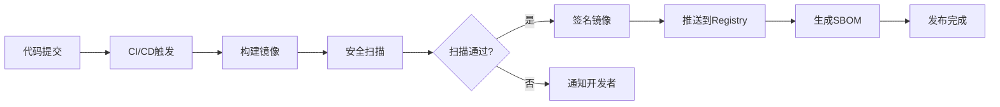

# Docker Registry 集成设计文档

## 概述

本文档描述 NAS-OS 项目与 Docker Registry 的集成方案，包括镜像存储、分发策略、安全控制和运维流程。

**版本**: v1.0.0
**作者**: 工部
**日期**: 2026-04-08

---

## 1. 当前架构分析

### 1.1 现有镜像发布流程

当前 NAS-OS 使用以下 Registry：

| Registry | 用途 | 状态 |
|----------|------|------|
| GHCR (ghcr.io/crazyqin/nas-os) | 主要发布目标 | ✅ 活跃 |
| Docker Hub (nasos/nas-os) | 公开分发 | ⏳ 待启用 |

**工作流文件**: `.github/workflows/docker-publish.yml`

**触发条件**:
- push 到 master/develop 分支
- 创建 v* 标签
- 手动触发 (workflow_dispatch)

### 1.2 镜像类型

| 镜像 | 大小 | 基础镜像 | 用途 |
|------|------|----------|------|
| nas-os (主镜像) | ~35MB | alpine | 生产环境 |
| nas-os-slim | ~18MB | distroless | 最小化部署 |
| nas-os-ai:gpu | ~2GB | nvidia/cuda | AI GPU 服务 |
| nas-os-ai:cpu | ~500MB | alpine | AI CPU 服务 |

### 1.3 支持平台

- **linux/amd64**: x86_64 服务器
- **linux/arm64**: ARM 服务器 (Orange Pi 5, Raspberry Pi 4/5)
- **linux/arm/v7**: ARM 32位设备 (Raspberry Pi 3)

---

## 2. Registry 选择方案

### 2.1 方案对比

| 方案 | 优点 | 缺点 | 适用场景 |
|------|------|------|----------|
| **GHCR** | 免费、与GitHub集成、支持OIDC | 需GitHub登录 | 开源项目首选 |
| **Docker Hub** | 公开访问、社区认知度高 | 限速、付费Pro | 公开分发 |
| **自建Registry** | 完全控制、无限速 | 维护成本高 | 企业私有 |
| **Harbor** | 企业级、安全扫描、RBAC | 复杂部署 | 企业生产 |
| **阿里云ACR** | 国内加速、免费额度 | 需实名认证 | 国内用户 |

### 2.2 推荐方案

**多Registry策略**:

```
                    ┌─────────────────┐
                    │  GitHub Actions │
                    └─────────────────┘
                           │
              ┌────────────┼────────────┐
              │            │            │
              ▼            ▼            ▼
        ┌─────────┐  ┌─────────┐  ┌─────────┐
        │  GHCR   │  │DockerHub│  │ 阿里云  │
        │ (主源)  │  │ (公开)  │  │ (国内)  │
        └─────────┘  └─────────┘  └─────────┘
              │            │            │
              ▼            ▼            ▼
        开发者用户    社区用户    国内用户
```

---

## 3. 集成方案设计

### 3.1 阿里云 ACR 集成

#### 3.1.1 配置步骤

1. **创建命名空间**
   ```bash
   # 登录阿里云容器镜像服务
   # 创建命名空间: nas-os
   ```

2. **创建镜像仓库**
   ```bash
   # 仓库名称: nas-os
   # 公开类型: 公开
   # 地域: cn-hangzhou (华东1)
   ```

3. **GitHub Secrets 配置**
   ```yaml
   # 新增 Secrets:
   ALIYUN_ACR_USERNAME: <阿里云账号>
   ALIYUN_ACR_PASSWORD: <Registry密码>
   ALIYUN_ACR_REGISTRY: registry.cn-hangzhou.aliyuncs.com/nas-os
   ```

#### 3.1.2 Workflow 修改

在 `docker-publish.yml` 的 `merge-manifest` job 中添加：

```yaml
- name: 登录阿里云 ACR
  uses: docker/login-action@v4
  if: github.event_name != 'pull_request'
  with:
    registry: registry.cn-hangzhou.aliyuncs.com
    username: ${{ secrets.ALIYUN_ACR_USERNAME }}
    password: ${{ secrets.ALIYUN_ACR_PASSWORD }}

- name: 推送到阿里云 ACR
  run: |
    docker buildx imagetools create -t registry.cn-hangzhou.aliyuncs.com/nas-os/nas-os:${SHORT_SHA} \
      ${{ env.REGISTRY }}/${{ env.IMAGE_NAME }}:${SHORT_SHA}-amd64 \
      ${{ env.REGISTRY }}/${{ env.IMAGE_NAME }}:${SHORT_SHA}-arm64 \
      ${{ env.REGISTRY }}/${{ env.IMAGE_NAME }}:${SHORT_SHA}-armv7
```

### 3.2 Docker Hub 启用

#### 3.2.1 准备工作

1. **创建 Docker Hub 组织**
   - 组织名: `nasos`
   - 仓库: `nas-os`

2. **配置 Secrets**
   ```yaml
   DOCKERHUB_USERNAME: nasos
   DOCKERHUB_TOKEN: <Docker Hub Access Token>
   ```

#### 3.2.2 Workflow 修改

现有 `docker-publish.yml` 已包含 Docker Hub 登录代码，仅需取消注释：

```yaml
# 当前已注释的代码块，取消注释即可
- name: 登录 Docker Hub
  uses: docker/login-action@v4
  if: github.event_name != 'pull_request'
  with:
    username: ${{ secrets.DOCKERHUB_USERNAME }}
    password: ${{ secrets.DOCKERHUB_TOKEN }}
```

---

## 4. 镜像标签策略

### 4.1 标签命名规则

| 标签类型 | 格式 | 示例 | 用途 |
|----------|------|------|------|
| 版本标签 | vX.Y.Z | v2.427.0 | 正式发布 |
| 短SHA | abc123 | abc1234 | CI构建 |
| latest | latest | latest | 最新稳定 |
| canary | canary | canary | 预览版 |
| 分支标签 | branch-sha | master-abc1234 | 开发分支 |
| 平台标签 | sha-platform | abc1234-arm64 | 单架构 |

### 4.2 标签生命周期

```
开发流程:
  develop 分支 → abc1234-develop (保留7天)
  
发布流程:
  master 分支 → abc1234 (保留30天)
  tag vX.Y.Z → vX.Y.Z (永久保留)
  latest → 更新为最新稳定版
  
清理策略:
  - CI构建标签: 保留30天后自动清理
  - 正式版本标签: 永久保留
  - latest/canary: 始终更新
```

---

## 5. 安全控制

### 5.1 镜像签名

当前使用 Cosign Keyless 签名：

```yaml
# docker-publish.yml 已实现
- name: 签名镜像 (Keyless)
  run: |
    cosign sign --yes ${{ env.REGISTRY }}/${{ env.IMAGE_NAME }}@${{ env.DIGEST }}
```

**验证方法**:
```bash
cosign verify ghcr.io/crazyqin/nas-os@sha256:xxx \
  --certificate-identity-regexp="https://github.com/crazyqin/nas-os/.github/workflows/" \
  --certificate-oidc-issuer="https://token.actions.githubusercontent.com"
```

### 5.2 SBOM 生成

```yaml
# docker-publish.yml 已实现
- name: 生成 SBOM
  run: |
    syft ${{ env.REGISTRY }}/${{ env.IMAGE_NAME }}:${{ env.SHORT_SHA }} -o spdx-json=sbom-spdx.json
    syft ${{ env.REGISTRY }}/${{ env.IMAGE_NAME }}:${{ env.SHORT_SHA }} -o cyclonedx-json=sbom-cyclonedx.json
```

### 5.3 安全扫描

| 扫描类型 | 工具 | 频率 | 工作流 |
|----------|------|------|--------|
| 漏洞扫描 | Trivy | 每次构建 | docker-publish.yml |
| 代码扫描 | CodeQL | 每次推送 | ci-cd.yml |
| 依赖扫描 | govulncheck | 每周一 | security-scan.yml |
| 静态分析 | gosec | 每次推送 | security-scan.yml |

---

## 6. CI/CD 优化建议

### 6.1 当前问题分析

| 问题 | 影响 | 建议 |
|------|------|------|
| armv7 构建超时 | QEMU模拟慢 | 增加timeout到50分钟 ✅已优化 |
| 缓存命中率 | 构建时间长 | 分离架构缓存 ✅已优化 |
| 多Registry推送 | 手动触发 | 自动化推送 |
| 镜像清理 | 旧镜像堆积 | 添加清理job |

### 6.2 优化方案

#### 6.2.1 增加镜像清理 Job

```yaml
# 在 docker-publish.yml 末尾添加
cleanup:
  name: 清理旧镜像
  runs-on: ubuntu-latest
  needs: [merge-manifest]
  if: github.ref == 'refs/heads/master'
  steps:
    - name: 清理 GHCR 旧版本
      uses: actions/delete-package-versions@v5
      with:
        package-name: nas-os
        package-type: container
        min-versions-to-keep: 10
        delete-untagged-versions: true
```

#### 6.2.2 构建缓存优化

当前已使用分离缓存策略：

```yaml
# 当前策略（已实现）
cache-from: |
  type=gha,scope=${{ env.CACHE_VERSION }}-${{ matrix.platform }}
  type=gha,scope=${{ env.CACHE_VERSION }}-${{ matrix.platform }}-master
cache-to: type=gha,scope=${{ env.CACHE_VERSION }}-${{ matrix.platform }},mode=max
```

建议增加跨版本缓存恢复：

```yaml
# 增加更多 restore-keys
restore-keys: |
  type=gha,scope=${{ env.CACHE_VERSION }}-${{ matrix.platform }}
  type=gha,scope=v12-${{ matrix.platform }}
  type=gha,scope=${{ matrix.platform }}
```

#### 6.2.3 并行推送到多Registry

```yaml
# 优化为并行推送
strategy:
  matrix:
    registry:
      - ghcr
      - dockerhub
      - aliyun
```

---

## 7. 运维流程

### 7.1 镜像发布流程



### 7.2 镜像拉取指南

#### GHCR
```bash
# 拉取最新版本
docker pull ghcr.io/crazyqin/nas-os:latest

# 拉取特定版本
docker pull ghcr.io/crazyqin/nas-os:v2.427.0

# 需要登录（公开仓库后可跳过）
echo $GITHUB_TOKEN | docker login ghcr.io -u USERNAME --password-stdin
```

#### 阿里云 ACR（国内加速）
```bash
# 拉取最新版本
docker pull registry.cn-hangzhou.aliyuncs.com/nas-os/nas-os:latest

# 国内用户推荐使用加速镜像
docker pull registry.cn-hangzhou.aliyuncs.com/nas-os/nas-os:v2.427.0
```

#### Docker Hub
```bash
# 拉取最新版本
docker pull nasos/nas-os:latest
```

### 7.3 镜像验证

```bash
# 验证签名
cosign verify ghcr.io/crazyqin/nas-os:latest

# 查看 SBOM
syft ghcr.io/crazyqin/nas-os:latest

# 安全扫描
trivy image ghcr.io/crazyqin/nas-os:latest
```

---

## 8. 监控与告警

### 8.1 监控指标

| 指标 | 方法 | 告警阈值 |
|------|------|----------|
| 构建时间 | GitHub Actions | >30分钟 |
| 镜像大小 | Trivy扫描 | >50MB |
| 漏洞数量 | Trivy/CodeQL | Critical>0 |
| 拉取次数 | Registry统计 | 异常下降 |

### 8.2 建议监控方案

```yaml
# 新增 monitoring job
monitor:
  name: 镜像监控
  runs-on: ubuntu-latest
  needs: [merge-manifest]
  steps:
    - name: 检查镜像大小
      run: |
        SIZE=$(docker manifest inspect $IMAGE | jq '.[0].size' | numfmt --to=iec)
        echo "镜像大小: $SIZE"
        # 告警阈值检查
        if [ $(echo "$SIZE" | sed 's/M//') -gt 50 ]; then
          echo "::warning::镜像大小超过50MB"
        fi
```

---

## 9. 实施计划

### Phase 1: Docker Hub 启用 (Week 1)

- [ ] 创建 Docker Hub 组织和仓库
- [ ] 配置 GitHub Secrets
- [ ] 取消注释 docker-publish.yml 中 Docker Hub 代码
- [ ] 测试推送流程

### Phase 2: 阿里云 ACR 集成 (Week 2)

- [ ] 创建阿里云 ACR 命名空间和仓库
- [ ] 配置 GitHub Secrets
- [ ] 修改 docker-publish.yml 添加 ACR 推送
- [ ] 测试国内拉取速度

### Phase 3: 清理与监控 (Week 3)

- [ ] 添加镜像清理 job
- [ ] 添加镜像大小监控
- [ ] 配置告警规则
- [ ] 文档更新

---

## 10. 附录

### A. 相关工作流文件

| 文件 | 功能 |
|------|------|
| `.github/workflows/docker-publish.yml` | 镜像构建与发布 |
| `.github/workflows/release.yml` | 二进制发布 |
| `.github/workflows/staged-release.yml` | 分阶段发布 |
| `.github/workflows/ci-cd.yml` | CI/CD主流程 |
| `.github/workflows/security-scan.yml` | 安全扫描 |

### B. Docker Compose 部署示例

```yaml
version: '3.8'
services:
  nas-os:
    image: ghcr.io/crazyqin/nas-os:latest
    container_name: nas-os
    restart: unless-stopped
    ports:
      - "8080:8080"
    volumes:
      - /mnt/data:/data
      - ./config:/config
    environment:
      - NAS_DATA_DIR=/data
      - NAS_CONFIG_DIR=/config
    healthcheck:
      test: ["CMD", "curl", "-f", "http://localhost:8080/api/v1/health"]
      interval: 30s
      timeout: 10s
      retries: 3
```

### C. 参考资料

- [GitHub Container Registry 文档](https://docs.github.com/en/packages/working-with-a-github-packages-registry/working-with-the-container-registry)
- [Docker Hub 最佳实践](https://docs.docker.com/docker-hub/)
- [阿里云容器镜像服务](https://help.aliyun.com/product/60716.html)
- [Cosign 签名文档](https://docs.sigstore.dev/cosign/signing/signing_with_containers/)
- [Syft SBOM 生成](https://github.com/anchore/syft)

---

**文档状态**: ✅ 完成
**下次审查**: 2026-05-08